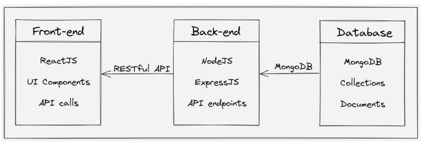
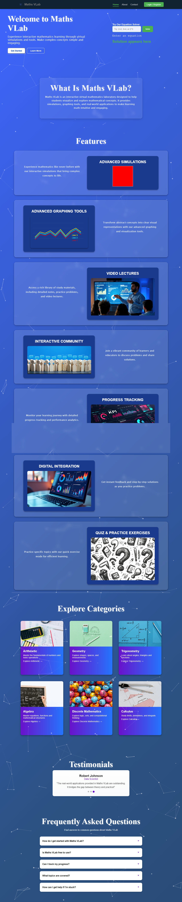
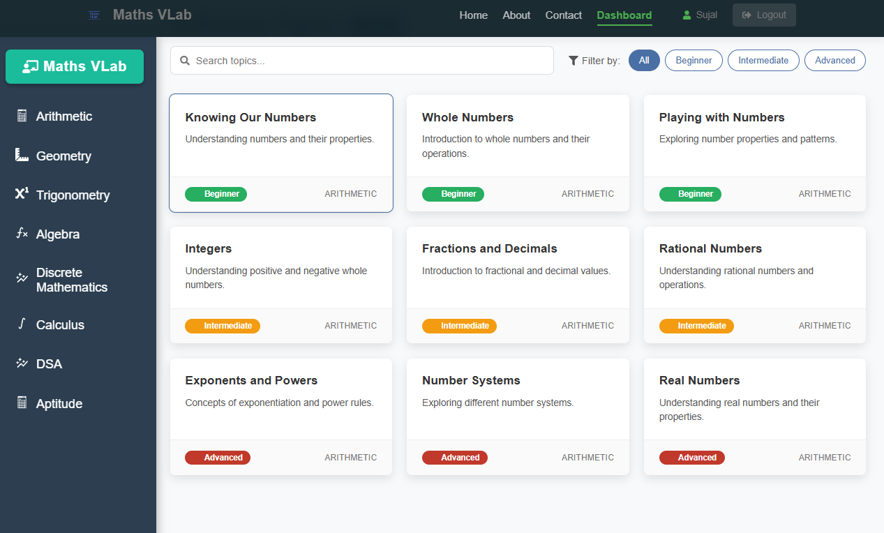
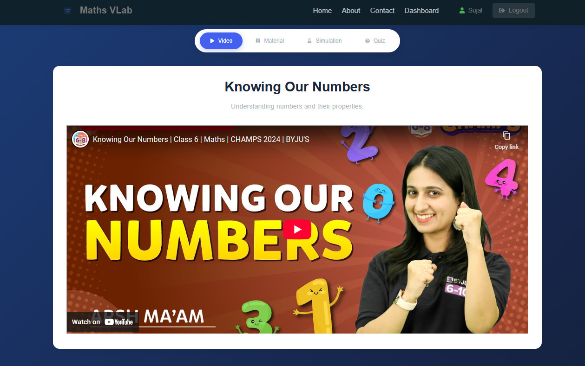

# Maths-VLab

Maths-VLab is a student-built educational platform designed to make learning mathematics interactive and fun. Built using the MERN stack (MongoDB, ExpressJS, ReactJS, NodeJS), the platform supports interactive simulations, videos, quizzes, and progress tracking for students, while also offering instructors tools to manage content and connect with learners.

---

## 🔧 Tech Stack

* **Frontend**: ReactJS, Tailwind CSS, Axios, Context API / Redux
* **Backend**: NodeJS, ExpressJS
* **Database**: MongoDB (via Mongoose)
* **Authentication**: Refresh Token Strategy, bcrypt

---

## 🧩 Features

* Interactive study content: Video, Text, Simulation, Quiz, Game
* Dynamic Study Page with tabbed interface for each content type
* Secure Authentication and User Management
* User Progress Tracking
* Instructor Content Management

---

## 📁 System Architecture

Maths-VLab follows a client-server model:

* **Frontend**: Built with ReactJS, it dynamically loads content through lazy loading and React Suspense. It manages the user interface and routes.
* **Backend**: Built with NodeJS and ExpressJS, it provides RESTful APIs for user auth, content management, and progress tracking.
* **Database**: MongoDB stores structured content in separate collections (Topic, VideoContent, Quiz, etc.), with references between them.

Here is a high-level diagram that illustrates the architecture


---

## 📲 Pages Overview

### For Students:

* **Home Page**: Welcome intro + featured content
* **Study Page**: Tabbed interface to access different types of study content
* **Progress Page**: Track your progress across topics

---

## 🔐 API Endpoints

### Authentication

* `POST /api/auth/signup`
* `POST /api/auth/login`
* `POST /api/auth/forgot-password`
* `POST /api/reset-password`

### Content

* `GET /api/topics/:topicId`
* `GET /api/textContent/:id`
* `GET /api/videoContent/:id`
* `GET /api/simulationContent/:id`
* `GET /api/quiz/:id`

### Progress

* `GET /api/progress/:userId`
* `POST /api/progress/:userId/:topicId`

---
## 🧪 Example Use Case

You can test the Study Content component by using the following mock payload:

```json
[{
  "_id": {
    "$oid": "6815f820114d09a14acec5dc"
  },
  "topicId": "1",
  "title": "Knowing Our Numbers",
  "description": "Understanding numbers and their properties.",
  "content": [
    {
      "type": "text",
      "data": {
        "text": "Numbers are used to count, measure, and label. Understanding place value and large numbers helps us operate efficiently in mathematics."
      }
    },
    {
      "type": "video",
      "data": {
        "youtubeUrl": "https://www.youtube.com/embed/n-zJaQzoe8s?si=JW_ZV4YaU7ZJ-ojc"
      }
    },
    {
      "type": "quiz",
      "data": [
        {
          "question": "What is the place value of 5 in 5,432?",
          "options": [
            "5",
            "50",
            "500",
            "5000"
          ],
          "correctAnswer": "5000"
        },
        {
          "question": "Which number is greater: 89,321 or 98,231?",
          "options": [
            "89,321",
            "98,231",
            "Equal",
            "Can't determine"
          ],
          "correctAnswer": "98,231"
        },
        {
          "question": "How many zeros are there in one lakh?",
          "options": [
            "4",
            "5",
            "6",
            "7"
          ],
          "correctAnswer": "5"
        }
      ]
    }
  ]
},
{
  "_id": {
    "$oid": "6815ffc4673d93c7d28ade84"
  },
  "topicId": "default",
  "title": "Default Topic",
  "description": "This is a default topic when the requested topic is not found.",
  "content": [
    {
      "type": "text",
      "data": {
        "text": "This is a placeholder for when the content of the topic is not available. Please check back later."
      }
    },
    {
      "type": "video",
      "data": {
        "youtubeUrl": "https://www.youtube.com/embed/rGQvs4G8W2k"
      }
    },
    {
      "type": "quiz",
      "data": [
        {
          "question": "What is 2 + 2?",
          "options": [
            "3",
            "4",
            "5",
            "6"
          ],
          "correctAnswer": "4"
        }
      ]
    }
  ]
}]

```

---

## 📸 Screenshots




---

Happy Learning! 📘✨
